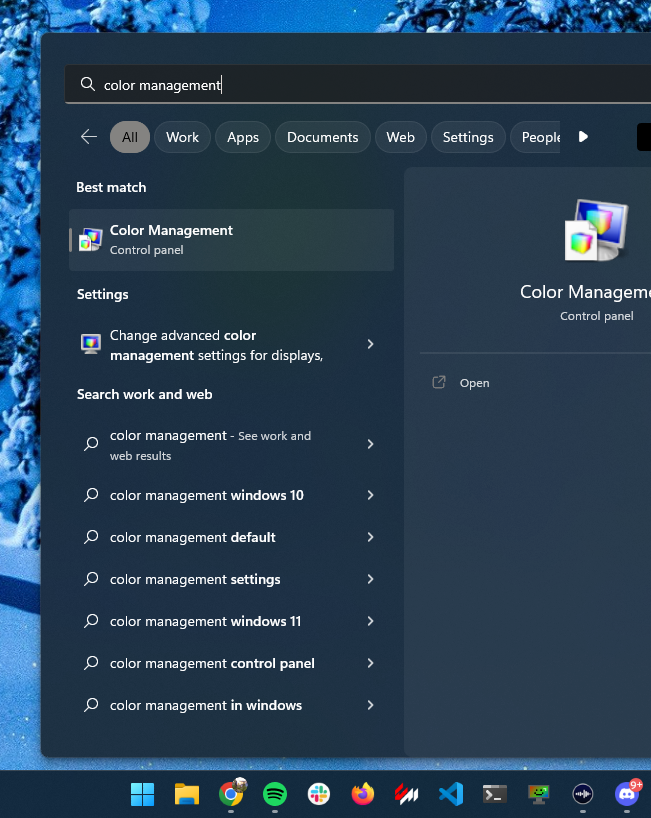
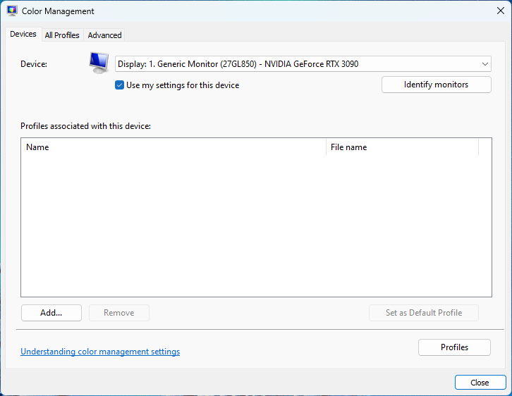
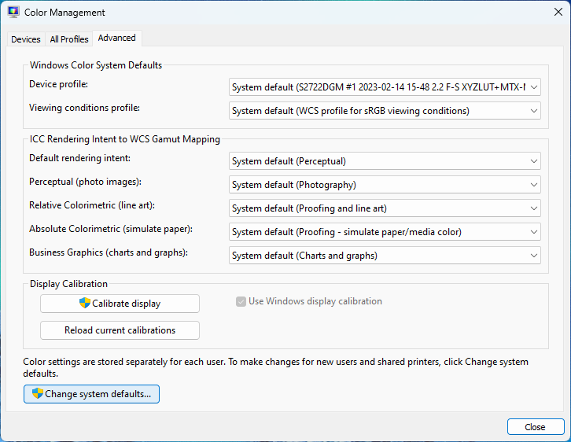
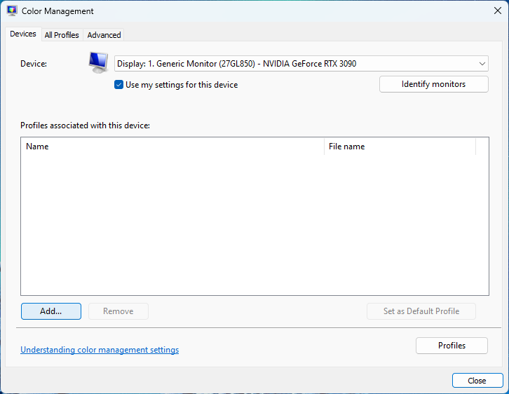
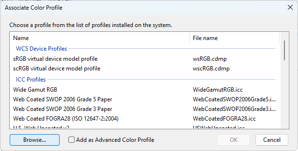
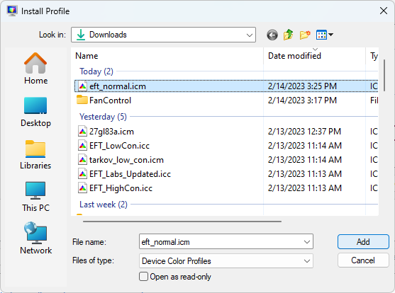
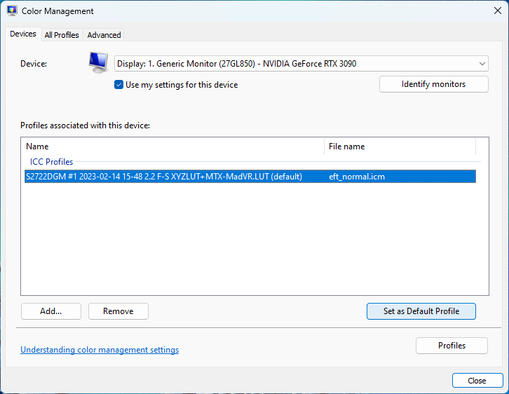
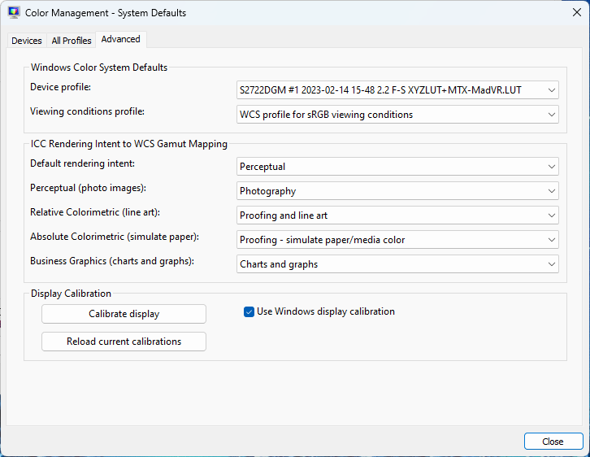

# For Nikita's Color Chads

- Download the ICM profile in this repo, most folks start with eft_normal.icm
  - eft_normal.icm is based off EFT_LowCon.cube
  - eft_mhc_acm_whatever.icm might be based off of EFT_HiCon.cube, but we are not sure
- Open Color Management via searching it on the Window Start Menu

- Check "Use my settings for this device"

- Click the "Advanced" tab at the top of the Color Management window
- Click "Change system defaults"

- Click "Add"

- Click "Browse"

- Navigate to the folder where you downloaded the .icm profile, select it, click Add

- Select the newly added ICM profile, and click "Set as Default Profile"

- Click the "Advanced" tab at the top of the Color Management window
- Make sure "Use Windows display calibration" is check in the "Display Calibration" section

- You are done, compare your settings to the settings in the screenshots above
- When testing these steps out sometimes it seemed like the profile wasn't applied, checking and unchecking "Use Windows display calibration" on the last screenshot seemed to fix this issue
- Profit